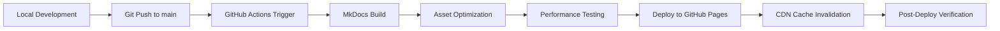

# AutoDocs Production Deployment & Maintenance Procedures

## Executive Summary

This document establishes comprehensive procedures for production deployment, maintenance, and quality assurance of the AutoDocs MCP Server documentation site. It provides standardized workflows, checklists, and monitoring procedures to ensure consistent, high-quality deployments and ongoing site reliability.

## 1. Production Deployment Architecture

### Current Deployment Stack
- **Hosting**: GitHub Pages
- **CDN**: GitHub's global CDN network
- **SSL/TLS**: Automatic HTTPS with GitHub's managed certificates
- **DNS**: Custom domain support with CNAME configuration
- **Build System**: GitHub Actions with MkDocs Material

### Deployment Pipeline Overview


## 2. Pre-Deployment Procedures

### 2.1 Development Environment Setup

**Prerequisites Checklist:**
- [ ] Python 3.11+ installed with uv package manager
- [ ] Git configured with proper user credentials
- [ ] MkDocs Material and dependencies installed
- [ ] Local development server functional (`uv run mkdocs serve`)
- [ ] Professional assets (logo.png, favicon.ico) present

**Local Development Workflow:**
```bash
# 1. Setup development environment
git clone https://github.com/bradleyfay/autodoc-mcp.git
cd autodocs
uv sync

# 2. Start local development server
uv run mkdocs serve --dev-addr 127.0.0.1:8000

# 3. Verify all pages load correctly
# Navigate to http://127.0.0.1:8000

# 4. Test responsive design
# Use browser dev tools to test mobile/tablet views

# 5. Validate links and assets
uv run python scripts/validate_links.py
```

### 2.2 Pre-Deployment Quality Gates

**Automated Quality Checklist (GitHub Actions):**
- [ ] **Build Verification**: MkDocs builds without errors
- [ ] **Link Validation**: All internal/external links functional
- [ ] **Performance Audit**: Lighthouse scores >90
- [ ] **Accessibility Testing**: axe-core validation passes
- [ ] **Security Scan**: No security vulnerabilities detected
- [ ] **Asset Optimization**: Images optimized and compressed

**Manual Quality Checklist:**
- [ ] **Content Review**: All new content reviewed for accuracy
- [ ] **Cross-browser Testing**: Chrome, Firefox, Safari, Edge
- [ ] **Mobile Responsiveness**: Tested on multiple device sizes
- [ ] **Search Functionality**: Site search works correctly
- [ ] **Navigation Flow**: All navigation paths functional
- [ ] **Asset Loading**: Logo, favicon, and images display correctly

### 2.3 Content Quality Assurance

**Documentation Standards Verification:**
```bash
# Run documentation quality assessment
uv run python scripts/doc_quality_assessment.py

# Expected output:
# ✅ All pages have proper heading structure
# ✅ Code examples present and properly formatted
# ✅ Internal links validated
# ✅ Readability scores acceptable
# ✅ Completeness metrics meet standards
```

**Content Checklist:**
- [ ] **Heading Structure**: Proper H1-H6 hierarchy maintained
- [ ] **Code Examples**: All code blocks have syntax highlighting
- [ ] **Screenshots**: Current and relevant to content
- [ ] **API Documentation**: Synchronized with actual implementation
- [ ] **Installation Instructions**: Tested and verified
- [ ] **Configuration Examples**: Accurate and complete

## 3. Deployment Execution

### 3.1 GitHub Actions Deployment Pipeline

**Deployment Workflow (`.github/workflows/deploy.yml`):**
```yaml
name: Deploy Documentation
on:
  push:
    branches: [ main ]
  workflow_dispatch:

jobs:
  quality-gates:
    runs-on: ubuntu-latest
    steps:
      - uses: actions/checkout@v4

      - name: Setup Python
        uses: actions/setup-python@v4
        with:
          python-version: '3.11'

      - name: Install uv
        run: pip install uv

      - name: Install dependencies
        run: uv sync

      - name: Validate content
        run: |
          uv run python scripts/validate_links.py
          uv run python scripts/doc_quality_assessment.py

      - name: Build documentation
        run: uv run mkdocs build --strict

      - name: Performance audit
        run: |
          npm install -g @lhci/cli
          lhci collect --url=http://localhost:8080 &
          uv run mkdocs serve --dev-addr 127.0.0.1:8080 &
          sleep 10
          lhci assert --config=lighthouserc.json

  deploy:
    needs: quality-gates
    runs-on: ubuntu-latest
    environment:
      name: github-pages
      url: ${{ steps.deployment.outputs.page_url }}
    permissions:
      pages: write
      id-token: write
    steps:
      - uses: actions/checkout@v4

      - name: Setup Python
        uses: actions/setup-python@v4
        with:
          python-version: '3.11'

      - name: Install dependencies
        run: |
          pip install uv
          uv sync

      - name: Build documentation
        run: uv run mkdocs build

      - name: Setup Pages
        uses: actions/configure-pages@v3

      - name: Upload artifact
        uses: actions/upload-pages-artifact@v2
        with:
          path: './site'

      - name: Deploy to GitHub Pages
        id: deployment
        uses: actions/deploy-pages@v2

  post-deploy:
    needs: deploy
    runs-on: ubuntu-latest
    steps:
      - name: Verify deployment
        run: |
          curl -f https://bradleyfay.github.io/autodoc-mcp/ || exit 1
          echo "✅ Site is live and responding"

      - name: Cache warm-up
        run: |
          # Warm up CDN cache with key pages
          curl -s https://bradleyfay.github.io/autodoc-mcp/product/getting-started/
          curl -s https://bradleyfay.github.io/autodoc-mcp/development/architecture/
          echo "✅ CDN cache warmed"
```

### 3.2 Manual Deployment Process

**Emergency Manual Deployment:**
```bash
# 1. Ensure working directory is clean
git status
git pull origin main

# 2. Build documentation locally
uv run mkdocs build

# 3. Verify build output
ls -la site/
du -sh site/

# 4. Test built site locally
cd site
python -m http.server 8080
# Test at http://localhost:8080

# 5. Deploy using gh-pages (if needed)
pip install ghp-import
ghp-import -n -p -f site/
```

## 4. Post-Deployment Verification

### 4.1 Automated Verification

**Health Check Script (`scripts/post_deploy_verification.py`):**
```python
#!/usr/bin/env python3
"""Post-deployment verification script."""

import requests
import time
from urllib.parse import urljoin

class DeploymentVerifier:
    def __init__(self, base_url: str):
        self.base_url = base_url.rstrip('/')
        self.session = requests.Session()

    def verify_deployment(self) -> bool:
        """Run complete deployment verification."""
        checks = [
            self.check_site_availability,
            self.check_key_pages,
            self.check_assets,
            self.check_performance,
            self.check_security_headers
        ]

        results = []
        for check in checks:
            try:
                result = check()
                results.append(result)
                print(f"{'✅' if result else '❌'} {check.__name__}")
            except Exception as e:
                print(f"❌ {check.__name__}: {str(e)}")
                results.append(False)

        return all(results)

    def check_site_availability(self) -> bool:
        """Check if site is accessible."""
        response = self.session.get(self.base_url, timeout=10)
        return response.status_code == 200

    def check_key_pages(self) -> bool:
        """Check critical pages are accessible."""
        key_pages = [
            '/',
            '/product/getting-started/',
            '/development/architecture/',
            '/journey/evolution/',
        ]

        for page in key_pages:
            url = urljoin(self.base_url, page)
            response = self.session.get(url, timeout=10)
            if response.status_code != 200:
                return False
        return True

    def check_assets(self) -> bool:
        """Check critical assets are loading."""
        assets = [
            '/assets/images/favicon.png',
            '/assets/stylesheets/main.7e37652d.min.css',
            '/assets/javascripts/bundle.50899def.min.js'
        ]

        for asset in assets:
            url = urljoin(self.base_url, asset)
            response = self.session.head(url, timeout=10)
            if response.status_code != 200:
                return False
        return True

    def check_performance(self) -> bool:
        """Basic performance checks."""
        start_time = time.time()
        response = self.session.get(self.base_url, timeout=30)
        load_time = time.time() - start_time

        # Check response time < 3 seconds
        if load_time > 3.0:
            return False

        # Check content size is reasonable
        if len(response.content) > 5 * 1024 * 1024:  # 5MB
            return False

        return True

    def check_security_headers(self) -> bool:
        """Check for security headers."""
        response = self.session.get(self.base_url, timeout=10)
        headers = response.headers

        # Check for HTTPS
        if not self.base_url.startswith('https://'):
            return False

        # Check for basic security headers
        required_headers = [
            'X-Frame-Options',
            'X-Content-Type-Options'
        ]

        for header in required_headers:
            if header not in headers:
                print(f"Missing security header: {header}")

        return True

if __name__ == "__main__":
    verifier = DeploymentVerifier("https://bradleyfay.github.io/autodoc-mcp")
    success = verifier.verify_deployment()

    if success:
        print("\n🎉 Deployment verification passed!")
    else:
        print("\n❌ Deployment verification failed!")
        exit(1)
```

### 4.2 Manual Verification Checklist

**Functional Verification:**
- [ ] **Homepage loads**: Main page displays correctly
- [ ] **Navigation works**: All menu items functional
- [ ] **Search functionality**: Site search returns results
- [ ] **Internal links**: All documentation links work
- [ ] **External links**: Links to GitHub, PyPI work
- [ ] **Mobile responsive**: Site works on mobile devices
- [ ] **Logo and favicon**: Brand assets display correctly

**Performance Verification:**
- [ ] **Page load speed**: Pages load in <3 seconds
- [ ] **Image optimization**: Images load quickly
- [ ] **CSS/JS minification**: Assets are minified
- [ ] **CDN distribution**: Content served from edge locations

**SEO and Analytics:**
- [ ] **Meta tags**: Proper title and description tags
- [ ] **Sitemap**: XML sitemap accessible and valid
- [ ] **Analytics tracking**: Analytics code functional
- [ ] **Social media cards**: Open Graph tags present

## 5. Maintenance Procedures

### 5.1 Routine Maintenance Schedule

**Daily Monitoring (Automated):**
- Site uptime monitoring
- Performance metrics collection
- Error log review
- Analytics data collection

**Weekly Maintenance:**
- [ ] **Content updates**: Review and update outdated content
- [ ] **Link validation**: Check for broken links
- [ ] **Performance audit**: Run Lighthouse performance tests
- [ ] **Security scan**: Check for vulnerabilities
- [ ] **Analytics review**: Analyze user behavior patterns

**Monthly Maintenance:**
- [ ] **Dependency updates**: Update MkDocs and plugins
- [ ] **Content audit**: Review all documentation for accuracy
- [ ] **Performance optimization**: Identify and fix performance issues
- [ ] **SEO review**: Update meta tags and content for search optimization
- [ ] **Backup verification**: Ensure all content is properly versioned in Git

**Quarterly Maintenance:**
- [ ] **Full accessibility audit**: Complete WCAG compliance review
- [ ] **User experience review**: Analyze user feedback and behavior
- [ ] **Technology stack review**: Evaluate new tools and technologies
- [ ] **Content strategy review**: Assess documentation effectiveness
- [ ] **Disaster recovery test**: Test backup and recovery procedures

### 5.2 Content Maintenance Workflow

**Content Update Process:**
```bash
# 1. Create feature branch for content updates
git checkout -b content/update-installation-guide

# 2. Make content changes
# Edit relevant .md files in docs/

# 3. Test changes locally
uv run mkdocs serve

# 4. Validate changes
uv run python scripts/doc_quality_assessment.py
uv run python scripts/validate_links.py

# 5. Commit changes with conventional commits
git add .
git commit -m "docs: update installation guide with uv package manager"

# 6. Push and create pull request
git push origin content/update-installation-guide
gh pr create --title "Update installation guide" --body "Updates installation instructions to use uv package manager"

# 7. Review and merge PR
# GitHub Actions will automatically deploy changes
```

**Content Review Process:**
1. **Technical Accuracy**: Verify all code examples and instructions
2. **Clarity**: Ensure content is clear and well-structured
3. **Completeness**: Check that all necessary information is included
4. **Consistency**: Maintain consistent terminology and style
5. **Accessibility**: Ensure content meets accessibility standards

### 5.3 Performance Optimization Maintenance

**Performance Monitoring Script (`scripts/performance_monitor.py`):**
```python
#!/usr/bin/env python3
"""Performance monitoring and optimization script."""

import subprocess
import json
import requests
from pathlib import Path

class PerformanceMonitor:
    def __init__(self, site_url: str):
        self.site_url = site_url
        self.results_dir = Path("performance_results")
        self.results_dir.mkdir(exist_ok=True)

    def run_lighthouse_audit(self) -> dict:
        """Run Lighthouse performance audit."""
        cmd = [
            "lighthouse",
            self.site_url,
            "--output=json",
            "--quiet",
            "--chrome-flags=--headless"
        ]

        result = subprocess.run(cmd, capture_output=True, text=True)
        if result.returncode == 0:
            return json.loads(result.stdout)
        else:
            raise Exception(f"Lighthouse failed: {result.stderr}")

    def analyze_performance(self, lighthouse_data: dict) -> dict:
        """Analyze Lighthouse performance data."""
        categories = lighthouse_data.get('categories', {})

        scores = {
            'performance': categories.get('performance', {}).get('score', 0) * 100,
            'accessibility': categories.get('accessibility', {}).get('score', 0) * 100,
            'best_practices': categories.get('best-practices', {}).get('score', 0) * 100,
            'seo': categories.get('seo', {}).get('score', 0) * 100
        }

        # Key metrics
        audits = lighthouse_data.get('audits', {})
        metrics = {
            'first_contentful_paint': audits.get('first-contentful-paint', {}).get('numericValue', 0),
            'largest_contentful_paint': audits.get('largest-contentful-paint', {}).get('numericValue', 0),
            'cumulative_layout_shift': audits.get('cumulative-layout-shift', {}).get('numericValue', 0),
            'total_blocking_time': audits.get('total-blocking-time', {}).get('numericValue', 0)
        }

        return {
            'scores': scores,
            'metrics': metrics,
            'timestamp': lighthouse_data.get('fetchTime')
        }

    def generate_performance_report(self) -> str:
        """Generate performance optimization recommendations."""
        lighthouse_data = self.run_lighthouse_audit()
        analysis = self.analyze_performance(lighthouse_data)

        report = []
        report.append("# Performance Analysis Report")
        report.append(f"Generated: {analysis['timestamp']}")
        report.append("")

        # Scores
        report.append("## Lighthouse Scores")
        for category, score in analysis['scores'].items():
            status = "✅" if score >= 90 else "⚠️" if score >= 70 else "❌"
            report.append(f"- {status} {category.replace('_', ' ').title()}: {score:.1f}/100")

        report.append("")

        # Metrics
        report.append("## Core Web Vitals")
        metrics = analysis['metrics']
        report.append(f"- First Contentful Paint: {metrics['first_contentful_paint']:.0f}ms")
        report.append(f"- Largest Contentful Paint: {metrics['largest_contentful_paint']:.0f}ms")
        report.append(f"- Cumulative Layout Shift: {metrics['cumulative_layout_shift']:.3f}")
        report.append(f"- Total Blocking Time: {metrics['total_blocking_time']:.0f}ms")

        return "\n".join(report)

if __name__ == "__main__":
    monitor = PerformanceMonitor("https://bradleyfay.github.io/autodoc-mcp")
    report = monitor.generate_performance_report()
    print(report)

    # Save report to file
    with open("performance_results/latest_report.md", "w") as f:
        f.write(report)
```

## 6. Incident Response Procedures

### 6.1 Site Down Response

**Immediate Response (0-15 minutes):**
1. **Verify issue**: Check site from multiple locations
2. **Check GitHub Status**: Verify GitHub Pages status
3. **Review recent changes**: Check last deployments
4. **Notify stakeholders**: Alert team of issue

**Investigation (15-30 minutes):**
1. **Check GitHub Actions**: Review deployment logs
2. **Analyze error logs**: Look for specific error messages
3. **Test locally**: Verify build process works locally
4. **Check DNS**: Verify domain resolution

**Resolution (30-60 minutes):**
1. **Roll back if needed**: Revert to last known good state
2. **Fix root cause**: Address underlying issue
3. **Redeploy**: Push fix and redeploy
4. **Verify fix**: Confirm site is working correctly

### 6.2 Performance Issue Response

**Performance Degradation Protocol:**
1. **Identify bottlenecks**: Run Lighthouse audit
2. **Check CDN status**: Verify content delivery network
3. **Optimize assets**: Compress images, minify code
4. **Update dependencies**: Check for performance improvements
5. **Monitor recovery**: Track performance metrics

### 6.3 Security Incident Response

**Security Issue Protocol:**
1. **Assess threat level**: Determine severity and impact
2. **Isolate if needed**: Take site offline if necessary
3. **Patch vulnerabilities**: Update affected dependencies
4. **Scan for compromise**: Check for unauthorized changes
5. **Monitor ongoing**: Implement additional security measures

## 7. Quality Assurance Framework

### 7.1 Quality Gates

**Deployment Quality Gates:**
- All automated tests must pass
- Performance scores must exceed 90
- Accessibility compliance verified
- Security scan must show no critical issues
- Manual review completed for content changes

**Content Quality Standards:**
- All code examples tested and verified
- Screenshots current and accurate
- Links validated and functional
- Writing follows style guide
- Accessibility requirements met

### 7.2 Continuous Improvement

**Monthly Review Process:**
1. **Analytics Review**: Analyze user behavior and feedback
2. **Performance Trends**: Track performance metrics over time
3. **Content Effectiveness**: Identify most/least useful content
4. **User Feedback**: Review and prioritize user suggestions
5. **Technical Debt**: Address accumulated technical issues

**Quarterly Planning:**
1. **Technology Updates**: Evaluate new tools and technologies
2. **Content Strategy**: Plan content improvements and additions
3. **User Experience**: Implement UX improvements
4. **Performance Goals**: Set new performance targets
5. **Training Needs**: Identify team skill development needs

---

**Document Version**: 1.0
**Last Updated**: 2025-08-11
**Next Review**: 2025-11-11
**Owner**: Bradley Fay
**Reviewers**: Development Team
