# Visual Communication Enhancement Guide

## Overview

This guide provides templates and standards for enhanced visual communication in AutoDocs documentation, focusing on clarity, accessibility, and user comprehension of complex technical concepts.

## Architectural Diagrams

### 1. System Architecture Diagram (Mermaid)


### 2. Request Flow Diagram


### 3. Decision Tree Diagrams

#### User Path Decision Tree

```mermaid
flowchart TD
    A[I want to use AutoDocs] --> B{What's your goal?}

    B --> C[Get it running quickly]
    B --> D[Understand how it works]
    B --> E[Solve a problem]
    B --> F[Contribute/Develop]

    C --> G[Installation Guide]
    G --> H[Getting Started]
    H --> I[First Success! 🎉]

    D --> J[Architecture Overview]
    J --> K[Technical Decisions]
    K --> L[Development Journey]

    E --> M[Troubleshooting Guide]
    M --> N{Found solution?}
    N -->|Yes| O[Problem Resolved! ✅]
    N -->|No| P[GitHub Issues]

    F --> Q[Contributing Guide]
    Q --> R[Development Setup]
    R --> S[Make Changes]

    style I fill:#c8e6c9
    style O fill:#c8e6c9
    style L fill:#e1f5fe
    style P fill:#ffecb3
```


#### MCP Tool Selection Decision Tree


## Enhanced Status Indicators

### Performance Status Cards
```markdown
<div class="status-grid">
  <div class="status-card success">
    <h4>🚀 Response Time</h4>
    <div class="metric">< 100ms</div>
    <div class="description">Cache hits are lightning fast</div>
  </div>

  <div class="status-card info">
    <h4>📊 Cache Hit Rate</h4>
    <div class="metric">85-95%</div>
    <div class="description">Most requests served from cache</div>
  </div>

  <div class="status-card warning">
    <h4>⏱️ First Request</h4>
    <div class="metric">3-5 seconds</div>
    <div class="description">Initial fetch time from PyPI</div>
  </div>
</div>
```

### Progress Indicators
```markdown
## Installation Progress

=== "Step 1: Install"
    ```bash
    uv tool install autodoc-mcp
    ```
    **Status**: ⏳ Installing packages...
    **Next**: Configuration

=== "Step 2: Configure"
    ```json
    {
      "mcpServers": {
        "autodoc-mcp": {
          "command": "autodoc-mcp"
        }
      }
    }
    ```
    **Status**: ⚙️ Setting up MCP integration...
    **Next**: Testing

=== "Step 3: Test"
    Ask your AI: "What packages are available?"

    **Status**: ✅ AutoDocs is working!
    **Next**: Start using AutoDocs
```

## Complex Concept Visualization

### 1. Cache Strategy Visualization

```markdown
## AutoDocs Caching Strategy

### Cache Key Structure
```
Package Cache Key: {package_name}-{resolved_version}
Examples:
├── fastapi-0.104.1.json
├── pydantic-2.5.2.json
└── starlette-0.27.0.json
```

### Cache Lifecycle


### Performance Comparison Table
| Scenario | Cache Status | Response Time | Network Requests |
|----------|--------------|---------------|------------------|
| First request (FastAPI + deps) | Miss | 3-5 seconds | 4-8 requests |
| Subsequent FastAPI requests | Hit | < 100ms | 0 requests |
| Related package (Pydantic) | Partial hit | 1-2 seconds | 1-3 requests |
| Popular package combo | Full hit | < 100ms | 0 requests |
```

### 2. Dependency Context Visualization

```markdown
## Smart Context System

### Context Scoping Levels


### Context Selection Algorithm
1. **Always Include**: Direct runtime dependencies
2. **Framework Priority**: FastAPI → Starlette, Django → ORM
3. **Popularity Weight**: Download count influences selection
4. **Token Budget**: Respect AI model context limits
5. **User Pattern**: Learn from common usage patterns
```

## Interactive Elements

### 1. Expandable Configuration Examples

```markdown
??? example "Basic Configuration"
    ```json
    {
      "mcpServers": {
        "autodoc-mcp": {
          "command": "autodoc-mcp"
        }
      }
    }
    ```

??? example "Performance Tuned Configuration"
    ```json
    {
      "mcpServers": {
        "autodoc-mcp": {
          "command": "autodoc-mcp",
          "env": {
            "MAX_CONCURRENT": "15",
            "MAX_DEPENDENCY_CONTEXT": "8",
            "CACHE_DIR": "~/.cache/autodoc-mcp"
          }
        }
      }
    }
    ```

??? example "Development Configuration"
    ```json
    {
      "mcpServers": {
        "autodoc-mcp": {
          "command": "python",
          "args": ["-m", "autodocs_mcp.main"],
          "cwd": "/path/to/autodoc-mcp",
          "env": {
            "LOG_LEVEL": "DEBUG",
            "CACHE_DIR": "./dev-cache"
          }
        }
      }
    }
    ```
```

### 2. Tabbed Code Examples

```markdown
=== "uv (Recommended)"
    ```bash
    # Fast, reliable package management
    uv tool install autodoc-mcp
    ```
    **Benefits**: Faster installation, better dependency resolution

=== "pip"
    ```bash
    # Traditional Python package manager
    pip install autodoc-mcp
    ```
    **Benefits**: Widely available, familiar to most users

=== "Development"
    ```bash
    # Get the latest features and contribute
    git clone https://github.com/bradleyfay/autodoc-mcp.git
    cd autodoc-mcp && uv sync --all-extras
    ```
    **Benefits**: Access to unreleased features, ability to contribute
```

## Accessibility and Mobile Optimization

### 1. Screen Reader Friendly Diagrams
```markdown
<!-- Always include alt text for complex diagrams -->


<!-- Provide text alternatives -->
**Architecture Description**:
AutoDocs MCP Server sits between AI assistants and PyPI, providing intelligent caching and context aggregation. Requests flow through the MCP protocol to core services (dependency parser, context fetcher, doc fetcher, cache manager) which coordinate with PyPI API to deliver comprehensive documentation context.
```

### 2. Mobile-Optimized Tables
```markdown
<!-- Use responsive table design -->
<div class="table-responsive">

| Tool | Purpose | Response Time | Use When |
|------|---------|---------------|----------|
| `get_package_docs_with_context` | Comprehensive docs with deps | 100ms-5s | You want full context |
| `scan_dependencies` | Parse project dependencies | < 100ms | Exploring a project |
| `get_cache_stats` | View cache information | < 10ms | Monitoring performance |

</div>
```

### 3. Progressive Enhancement
```markdown
<!-- Basic content works without JavaScript/CSS -->
## Key Features

- Smart dependency context
- High performance caching
- Production-ready reliability

<!-- Enhanced with CSS -->
<div class="feature-grid" role="list">
  <div class="feature-card" role="listitem">
    <h3>🧠 Smart Context</h3>
    <p>Automatically includes 3-8 most relevant dependencies</p>
  </div>
  <div class="feature-card" role="listitem">
    <h3>⚡ High Performance</h3>
    <p>Version-based caching with < 100ms response times</p>
  </div>
  <div class="feature-card" role="listitem">
    <h3>🛡️ Production Ready</h3>
    <p>Circuit breakers, health monitoring, graceful degradation</p>
  </div>
</div>
```

## Implementation Guidelines

### 1. CSS Enhancements for Extra.css
```css
/* Status cards for performance metrics */
.status-grid {
  display: grid;
  grid-template-columns: repeat(auto-fit, minmax(200px, 1fr));
  gap: 1rem;
  margin: 1rem 0;
}

.status-card {
  padding: 1rem;
  border-radius: 8px;
  text-align: center;
  border: 1px solid var(--md-default-fg-color--lightest);
}

.status-card.success { border-left: 4px solid #4caf50; }
.status-card.info { border-left: 4px solid #2196f3; }
.status-card.warning { border-left: 4px solid #ff9800; }

.status-card .metric {
  font-size: 1.5rem;
  font-weight: bold;
  margin: 0.5rem 0;
}

/* Feature grid for key features */
.feature-grid {
  display: grid;
  grid-template-columns: repeat(auto-fit, minmax(250px, 1fr));
  gap: 1.5rem;
  margin: 2rem 0;
}

.feature-card {
  padding: 1.5rem;
  background: var(--md-code-bg-color);
  border-radius: 8px;
  border: 1px solid var(--md-default-fg-color--lightest);
}

/* Responsive tables */
.table-responsive {
  overflow-x: auto;
  margin: 1rem 0;
}

.table-responsive table {
  min-width: 600px;
}

/* Mobile optimizations */
@media (max-width: 768px) {
  .feature-grid {
    grid-template-columns: 1fr;
  }

  .status-grid {
    grid-template-columns: 1fr;
  }
}
```

### 2. Mermaid Configuration
```yaml
# In mkdocs.yml
markdown_extensions:
  - pymdownx.superfences:
      custom_fences:
        - name: mermaid
          class: mermaid
          format: !!python/name:pymdownx.superfences.fence_code_format

extra_javascript:
  - https://unpkg.com/mermaid@9.4.0/dist/mermaid.min.js
```

### 3. Content Testing Checklist
- [ ] **Diagrams render correctly** in both light and dark themes
- [ ] **Mobile responsiveness** - tables scroll, cards stack properly
- [ ] **Screen reader compatibility** - alt text and semantic markup
- [ ] **Performance impact** - images optimized, minimal JavaScript
- [ ] **Cross-browser compatibility** - test in major browsers
- [ ] **Print-friendly** - diagrams and layouts work in print view

---

This visual communication guide transforms complex technical concepts into accessible, engaging content that serves users across different devices and accessibility needs.
