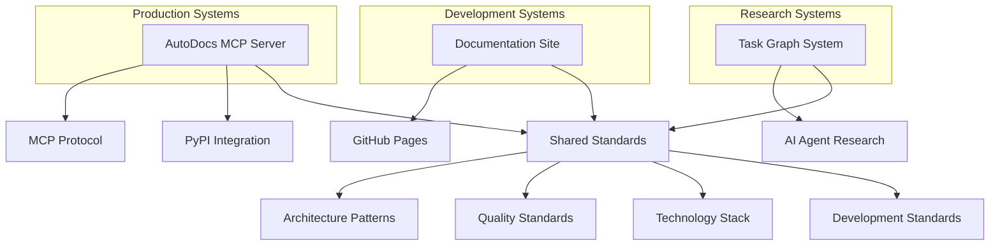

# Multi-Project Architecture Overview

**Purpose**: High-level architecture of the multi-project ecosystem
**Audience**: Developers, AI agents, and technical stakeholders
**Updated**: August 11, 2025

## 🏗️ System Architecture Philosophy

### Multi-Project Design Principles

#### Project Autonomy with Shared Foundation
Each project operates independently while leveraging shared:
- **Development Standards**: Consistent code quality, testing, and documentation approaches
- **Technology Stack**: Common tools, frameworks, and infrastructure patterns
- **Architecture Patterns**: Reusable design solutions and integration protocols
- **Quality Standards**: Testing, security, and performance requirements

#### Agent-First Architecture
The entire system is designed for AI agent collaboration:
- **Context-Rich Documentation**: Structured information for AI understanding
- **Tool Integration**: Native MCP protocol support for AI development environments
- **Autonomous Operation**: Systems that agents can operate with minimal human intervention
- **Extensible Design**: Architecture that agents can enhance and modify

---

## 📊 Project Portfolio Architecture

### Current Project Ecosystem



### Project Relationship Matrix

| Project | AutoDocs MCP | Documentation Site | Task Graph System |
|---------|-------------|-------------------|-------------------|
| **AutoDocs MCP** | - | Provides content & examples | Provides MCP expertise |
| **Documentation Site** | Documents & showcases | - | May showcase research |
| **Task Graph System** | May use MCP patterns | May be documented | - |

### Shared Infrastructure Components

#### Development Infrastructure
- **Version Control**: Git with GitHub for all projects
- **CI/CD**: GitHub Actions with standardized workflows
- **Package Management**: uv for Python, npm for JavaScript
- **Quality Tools**: Ruff, MyPy, pytest for consistent code quality

#### Documentation Infrastructure
- **Documentation as Code**: Markdown in version control
- **Automated Deployment**: GitHub Actions to GitHub Pages
- **Cross-References**: Consistent linking between projects
- **Agent Context**: Structured documentation for AI consumption

#### Monitoring & Observability
- **Health Checks**: Standardized health endpoints across projects
- **Structured Logging**: Consistent logging format for analysis
- **Performance Metrics**: Common metrics collection patterns
- **Error Tracking**: Structured error reporting and analysis

---

## 🤖 AI Agent Integration Architecture

### MCP Protocol as Core Integration Layer

#### AutoDocs MCP Server
```python
# Core MCP server providing AI development assistance
class AutoDocsMCPServer:
    """MCP server for AI development assistance"""

    def scan_dependencies(self, project_path: str) -> DependencyInfo:
        """Parse project dependencies with graceful degradation"""

    def get_package_docs_with_context(self, package: str) -> ContextualDocs:
        """Fetch comprehensive documentation context"""

    def health_check(self) -> HealthStatus:
        """Production-ready health monitoring"""
```

#### Agent Context Management
```python
# How agents access cross-project context
class AgentContext:
    """Manages context for AI agents across projects"""

    shared_standards: SharedStandards
    project_context: Dict[str, ProjectContext]
    integration_protocols: IntegrationProtocols

    def get_project_context(self, project_name: str) -> ProjectContext:
        """Retrieve project-specific context"""

    def get_shared_context(self) -> SharedContext:
        """Retrieve cross-project shared context"""
```

### Agent Coordination Patterns

#### Context Sharing Protocol
1. **Agent Initialization**: Agent reads project-specific CLAUDE.md
2. **Shared Context Access**: Agent accesses cross-project standards and patterns
3. **Integration Awareness**: Agent understands how projects connect
4. **Consistent Application**: Agent applies shared patterns while respecting project uniqueness

#### Cross-Project Communication
- **Shared Documentation**: Common knowledge base in `planning/cross-project/`
- **Standard Interfaces**: Consistent APIs and integration patterns
- **Event Protocols**: How projects notify each other of changes
- **Error Handling**: Graceful degradation when cross-project dependencies fail

---

## 📁 Information Architecture

### Documentation Hierarchy for AI Agents

```
planning/
├── PLANNING_INDEX.md                 # Master navigation and context entry point
├── projects/                         # Project-specific agent context
│   ├── autodocs-mcp/                # Production MCP server
│   │   ├── PROJECT_INDEX.md         # Project overview and navigation
│   │   ├── active/                  # Current priorities and status
│   │   ├── reference/               # Core specifications and architecture
│   │   ├── phases/                  # Historical development phases
│   │   └── expansion/               # Future roadmap and plans
│   ├── documentation-site/          # Documentation and content strategy
│   └── task-graph-system/           # AI agent research project
├── cross-project/                   # Shared agent context
│   ├── AGENT_CONTEXT_ARCHITECTURE.md # How agents share context
│   ├── DEVELOPMENT_PHILOSOPHY.md    # Core principles and approaches
│   ├── shared_standards.md          # Development and quality standards
│   ├── technology_decisions.md      # Technology stack and rationale
│   └── ARCHITECTURE_OVERVIEW.md     # This document - system architecture
└── templates/                       # Standardized project structures
    ├── PROJECT_TEMPLATE/            # Template for new projects
    ├── tracking_templates.md        # Progress tracking formats
    └── meeting_templates.md         # Communication templates
```

### Context Access Patterns for Agents

#### Project-Specific Work
1. Start with `projects/{project}/PROJECT_INDEX.md`
2. Access `projects/{project}/active/` for current status
3. Reference `projects/{project}/reference/` for technical details
4. Apply shared patterns from `cross-project/`

#### Cross-Project Work
1. Start with `PLANNING_INDEX.md` for portfolio overview
2. Access `cross-project/ARCHITECTURE_OVERVIEW.md` for system understanding
3. Review `cross-project/shared_standards.md` for consistency requirements
4. Apply patterns consistently across all affected projects

---

## 🔧 Technology Architecture

### Core Technology Stack

#### Python Ecosystem (AutoDocs MCP, Task Graph Research)
```python
# Standard technology stack for Python projects
python_stack = {
    "runtime": "Python 3.12+",
    "package_manager": "uv",
    "web_framework": "FastMCP (MCP) | FastAPI (general)",
    "async_runtime": "asyncio",
    "http_client": "httpx",
    "data_validation": "Pydantic v2",
    "testing": "pytest ecosystem",
    "quality": "Ruff + MyPy",
    "deployment": "PyPI packages"
}
```

#### Web Development Stack (Documentation Site)
```javascript
// Standard technology stack for web projects
const webStack = {
    framework: "Next.js (React)",
    language: "TypeScript",
    styling: "Tailwind CSS",
    buildTool: "Vite | Next.js",
    packageManager: "npm | yarn",
    deployment: "GitHub Pages | Vercel"
}
```

#### Development Tools (All Projects)
```yaml
# Shared development tooling
development_tools:
  version_control: "Git + GitHub"
  ci_cd: "GitHub Actions"
  code_quality: "Ruff, MyPy, pre-commit"
  documentation: "Markdown + GitHub Pages"
  monitoring: "Health checks + structured logging"
```

### Integration Architecture

#### MCP Protocol Integration
```python
# How projects integrate with AI development environments
class MCPIntegration:
    """Standard MCP integration pattern"""

    def register_tools(self) -> List[MCPTool]:
        """Register project-specific MCP tools"""

    def handle_requests(self, request: MCPRequest) -> MCPResponse:
        """Handle MCP requests with error handling"""

    def health_check(self) -> HealthStatus:
        """Provide health status for monitoring"""
```

#### Documentation Deployment Architecture
```yaml
# How documentation is built and deployed
documentation_deployment:
  source: "planning/ directory markdown files"
  build: "GitHub Actions workflow"
  processing: "Markdown to static site generation"
  deployment: "GitHub Pages"
  domain: "Custom domain for documentation site"
```

---

## 📈 Scalability & Evolution Architecture

### Horizontal Project Scaling

#### Adding New Projects
1. **Use Project Template**: Start with standardized structure from `templates/PROJECT_TEMPLATE/`
2. **Apply Shared Standards**: Inherit development standards and technology stack
3. **Create Project Context**: Establish project-specific CLAUDE.md and documentation
4. **Update Portfolio**: Add to `PLANNING_INDEX.md` and cross-project coordination

#### Project Lifecycle Management
- **Research Phase**: Minimal structure, focused on exploration and feasibility
- **Development Phase**: Full project structure with active development
- **Production Phase**: Mature project with maintenance and enhancement focus
- **Archive Phase**: Completed projects moved to archived/ with preserved documentation

### Vertical Feature Scaling

#### Enhanced Agent Capabilities
- **Specialized Agents**: Different types of agents for different project needs
- **Agent Learning**: Systems that improve through agent interactions
- **Cross-Agent Communication**: Agents sharing insights and learnings
- **Autonomous Coordination**: Agents coordinating work across projects

#### Advanced Integration Patterns
- **Service Mesh**: If projects become distributed services
- **Event-Driven Architecture**: Asynchronous communication between projects
- **API Federation**: Unified API layer across multiple projects
- **Shared Data Layer**: Common data storage and access patterns

---

## 🔒 Security & Reliability Architecture

### Security Patterns

#### Input Validation & Sanitization
```python
# Standard security patterns across all projects
class SecurityPatterns:
    """Shared security implementations"""

    @staticmethod
    def validate_input(data: Any, schema: Type[BaseModel]) -> BaseModel:
        """Validate all external inputs"""

    @staticmethod
    def sanitize_error_message(error: Exception) -> str:
        """Prevent information leakage in errors"""

    @staticmethod
    def audit_log(action: str, context: Dict) -> None:
        """Structured audit logging"""
```

#### Dependency Management
- **Automated Scanning**: Regular vulnerability scans of all dependencies
- **Version Pinning**: Explicit version control for reproducible builds
- **License Compliance**: Ensure all dependencies have compatible licenses
- **Supply Chain Security**: Verify integrity of package sources

### Reliability Patterns

#### Graceful Degradation
```python
# How systems handle partial failures
async def fetch_with_fallback(primary_source, fallback_source):
    """Standard pattern for reliability"""
    try:
        return await primary_source()
    except Exception as e:
        logger.warning(f"Primary source failed: {e}")
        return await fallback_source()
```

#### Health Monitoring
- **Health Endpoints**: Standardized health checks across all projects
- **Dependency Checks**: Monitor health of external dependencies
- **Performance Metrics**: Track key performance indicators
- **Alert Systems**: Proactive notification of system issues

---

## 🔮 Future Architecture Evolution

### Planned Architectural Enhancements

#### Enhanced AI Integration
- **Multi-Modal Agents**: Support for agents that work with text, images, and other media
- **Agent Orchestration**: Sophisticated coordination of multiple AI agents
- **Learning Systems**: Architecture that improves through usage and feedback
- **Context Optimization**: More sophisticated context management for large projects

#### Advanced Development Patterns
- **Micro-Frontend Architecture**: If web applications become complex
- **Event Sourcing**: For projects requiring detailed audit trails
- **CQRS Patterns**: Separate read/write patterns for performance
- **Distributed Systems**: If projects require multi-instance deployment

### Long-term Architectural Vision
- **AI-Native Development Platform**: Complete platform for AI-assisted development
- **Community Ecosystem**: Architecture supporting external contributions and extensions
- **Enterprise Integration**: Patterns for large-scale organizational deployment
- **Open Source Leadership**: Architecture that influences industry standards

---

*Architecture overview established: August 11, 2025*
*Architecture supports AI agent collaboration and documentation site deployment*
*Living document that evolves with system complexity and capabilities*
